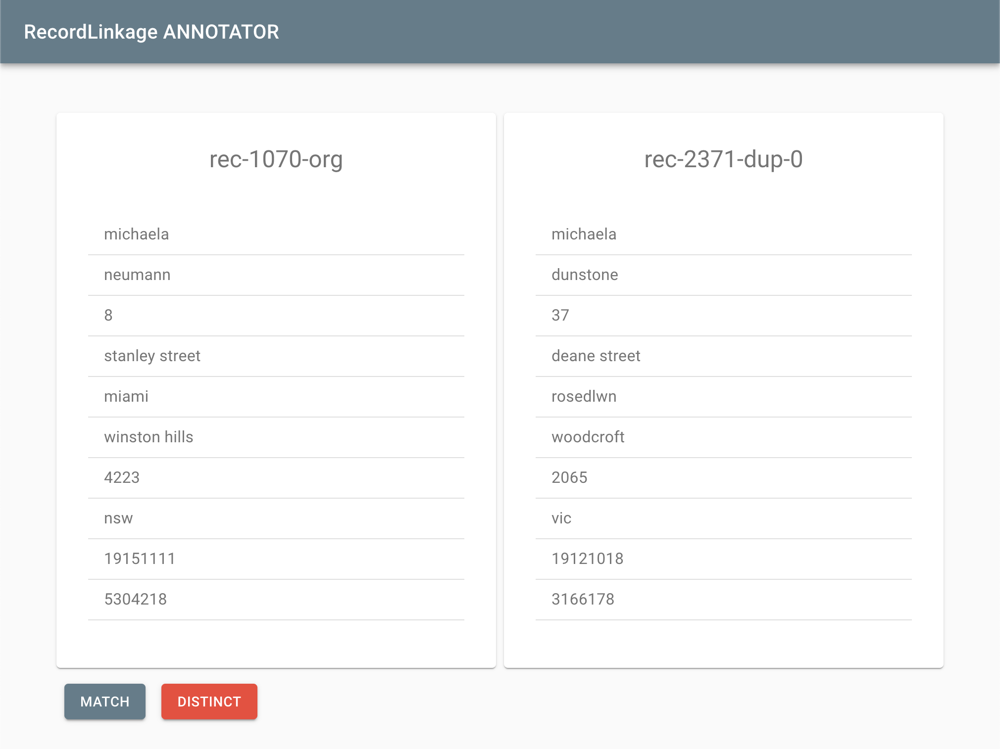

# RecordLinkage ANNOTATOR :bangbang: WORK IN PROGRESS :bangbang:

*RecordLinkage ANNOTATOR* is a browser-based user interface for
manual labeling of record pairs. Manual labeled or annotated data is useful 
for training and validation models. The application provides the annotator a clean and intuitive interface. The annotator labels the record pair as "Match" or "Distinct". The output can be exported and used for training and validation. This application is part of the 
[Python Record Linkage Toolkit](https://github.com/J535D165/recordlinkage), but can be used as a standalone tool. 

:arrow_right: :arrow_right: Check out the [hosted version of *RecordLinkage ANNOTATOR*](https://j535d165.github.io/recordlinkage-annotator/) :arrow_left: :arrow_left:

Want to give it a try? Download our [**Prison book**](https://raw.githubusercontent.com/J535D165/recordlinkage-annotator/master/examples/annotation_dishonesty.json) example file :cop: :suspect:

The hosted version of [*RecordLinkage ANNOTATOR*](https://j535d165.github.io/recordlinkage-annotator/) on [Github-pages](https://pages.github.com/) makes use of client-side Javascript 
only. The tool doesn't upload data. Not convinced about the safety of your data? That's 
fine. You can deploy the code yourself locally. Please read the [Development](#development) instructions.  

## Create annotation file

*RecordLinkage ANNOTATOR* requires an annotation file as input. This JSON file contains your record pairs and defines an comparison schema. The [Python Record Linkage Toolkit](https://github.com/J535D165/recordlinkage) can be used to render such a file. For more information, see the documention on [Manual Labeling](https://recordlinkage.readthedocs.io/en/latest/annotation.html). 

Version 1 of the schema is open source and can be found [here](/schema). Examples of annotation files can be found in the [examples](/examples) folder. 

## Extract results

*RecordLinkage ANNOTATOR* exports the results of the annotation in an annotation file with the same structure as the input annotation file. This makes it simple to review the annotation or continue the labeling the data. The [Python Record Linkage Toolkit](https://github.com/J535D165/recordlinkage) can be used to read the annotation file and extract the links and distinct pairs. For more information, see the documention on [Manual Labeling](https://recordlinkage.readthedocs.io/en/latest/annotation.html).

## Development

*RecordLinkage ANNOTATOR* is a [React](https://reactjs.org/) application. You can develop or deploy the project locally with `npm start`.

## License 

BSD 3-Clause License
